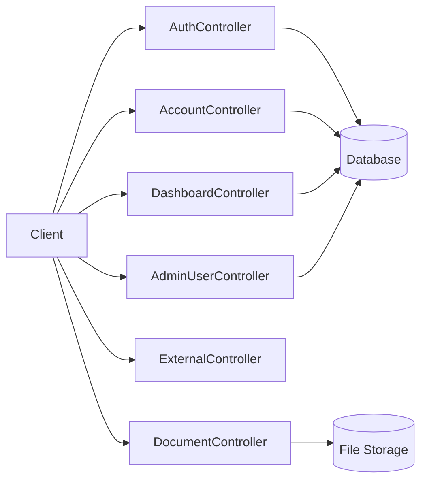
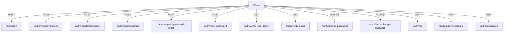
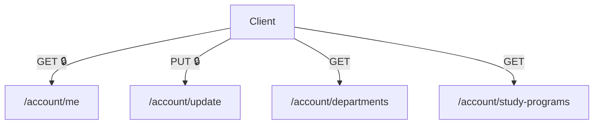
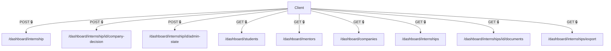
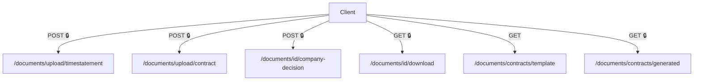
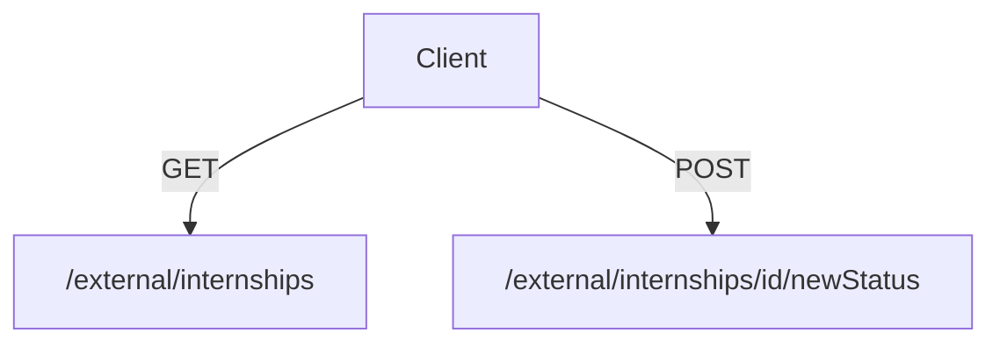
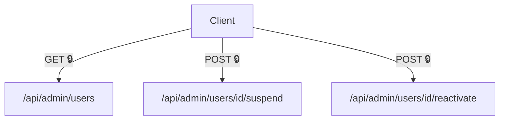

# Systém evidencie praxe (Internship Management System)

## Členovia tímu
- Martin Kopáč (vedúci tímu)
- Jakub Antala
- Martin Molnár
- Matej Svrček
- Lukáš Valenta

## Použité technológie

| Komponent              | Technológia          |
| ---------------------- | -------------------- |
| Frontend               | React                |
| Backend                | Spring Boot          |
| Databáza               | MySQL                |
| Riadenie projektu      | Jira                 |
| Správa verzií          | GitHub               |
| UML diagramy           | Enterprise Architect |

## Funkčnosť systému

Systém evidencie praxe slúži na správu, evidenciu a kontrolu odbornej praxe študentov na FPVaI UKF Nitra.

### Používatelia a registrácia

V systéme figurujú 3 aktéri (študent, zástupca firmy v ktorej študent praxuje a garant praxe). Systém ponúka dva spôsoby vytvárania účtov a to je registrácia spojená s aktiváciou účtu pre študentov a "firmy". Pri garantoch sa využíva enrollment.

### Správa praxe

Vrámci správy praxe majú študenti možnosť zahájiť prax v hociktorej z firiem, ktoré sú v systéme zaregistrované. Systém podporuje rôzne formy študentskej praxe, či už krátkodobú odbornú prax, práca na dohodu alebo živnosť.

## Spustenie projektu

V tejto kapitole bude opísané, ako je možné projekt spustiť pomocou Docker alebo lokálne.

### Spustenie pomocou Docker
- nainštalovaný Docker a povolené WSL
- MySQL 8.0

V termínale vstúpte do directory `..\SE_Project\` a projekt spustíte nasledujúcimi príkazmi:
```
docker compose build
docker compose up -d
```

#### Správa databázy:
- pomocou nástroja na správu SQL relačných databáz (napr. MySQL Workbench) si vytvorte connector s nasledujúcimi údajmi
- Hostname: localhost
- Port: 3306
- Username: root
- Password: rootpassword

### Lokálne spustenie
- Java: JDK 21 (LTS) 
- Apache Maven: 3.9.11
- Node.js: Node 22 LTS
- SQL: 8.0 +

#### Projekt sa spúšťa pomocou dvoch terminálov:
V prvom terminále je nutné vstúpiť do directory `..\SE_Project\frontend\odborna-prax-web\` a zadať nasledovné príkazy:
```
npm install
npm run dev
```
V druhom terminále je nutné vstúpiť do directory `..\SE_Project\backend\odborna-prax-api\` a zadať nasledovné príkazy:
```
mvn spring-boot:run
```
Oba terminále musia zostať spustené.

#### Lokálna databáza MySQL
Pre správnu funkciu je nutné mať správne údaje v súbore `..\SE_Project\application.properties` ktorý sa nachádza v starších verziách projektu pred Docker-izáciou.
Jedná sa o riadky:
```
spring.datasource.url=jdbc:mysql://localhost:3306/internship_management
spring.datasource.username=root
spring.datasource.password=
```
Následne si vytvorte databázu s názvom `internship_management` a vložte SQL príkazy z `..\SE_Project\database\v1.0.1 - v1.0.8\`.


## API Dokumentácia

Táto sekcia obsahuje vizuálnu dokumentáciu REST API.

OpenAPI dokumentácia sa nachádza na adrese https://localhost:8443/swagger-ui/index.html#/

---

### Legenda
- 🔒 – endpoint vyžaduje autentifikáciu (JWT token)
- `Client` – frontend / externý konzument API
- Controller – backendová REST vrstva
- DB – databáza
- File Storage – úložisko dokumentov

---

### Celková architektúra API





---



---



---



---



---

