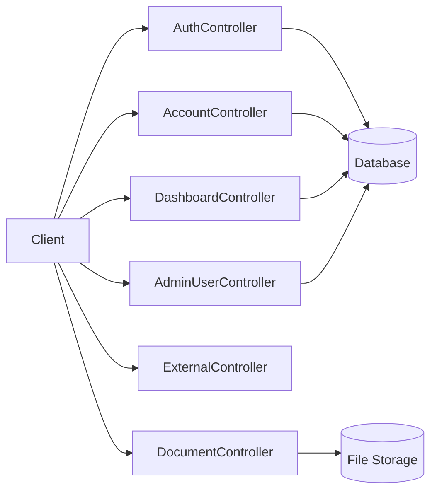
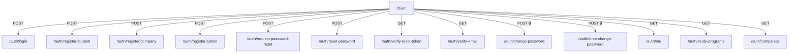
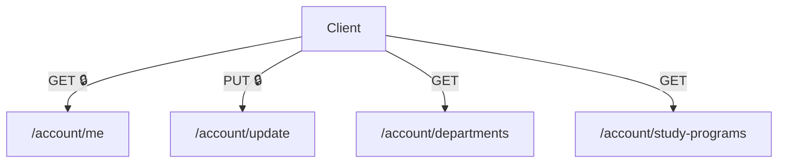
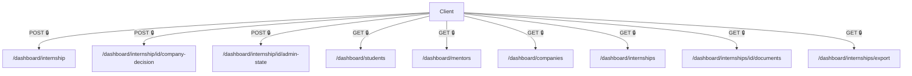
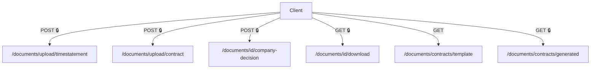
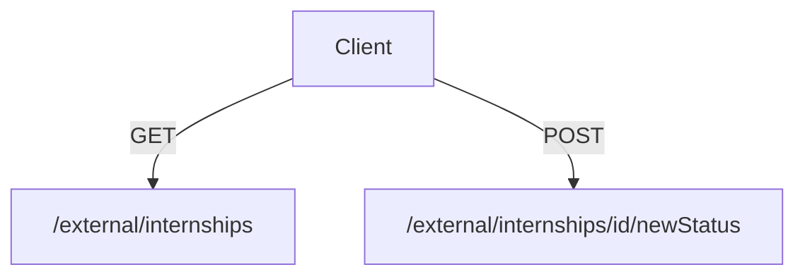
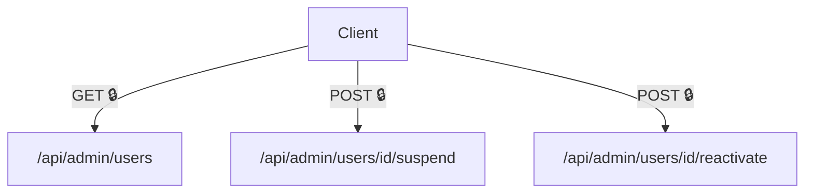

## API Dokumentácia

Táto sekcia obsahuje vizuálnu dokumentáciu REST API.

OpenAPI dokumentácia sa nachádza na adrese https://localhost:8443/swagger-ui/index.html#/

---

### Legenda
- 🔒 – endpoint vyžaduje autentifikáciu (JWT token)
- `Client` – frontend / externý konzument API
- Controller – backendová REST vrstva
- DB – databáza
- File Storage – úložisko dokumentov

---

### Celková architektúra API

---

---

---

---

---

