```mermaid
flowchart TD
    Client -->|GET 🔒| /account/me
    Client -->|PUT 🔒| /account/update
    Client -->|GET| /account/departments
    Client -->|GET| /account/study-programs
```

```mermaid
flowchart TD
    Client -->|POST 🔒| /dashboard/internship
    Client -->|POST 🔒| /dashboard/internship/id/company-decision
    Client -->|POST 🔒| /dashboard/internship/id/admin-state

    Client -->|GET 🔒| /dashboard/students
    Client -->|GET 🔒| /dashboard/mentors
    Client -->|GET 🔒| /dashboard/companies

    Client -->|GET 🔒| /dashboard/internships
    Client -->|GET 🔒| /dashboard/internships/id/documents
    Client -->|GET 🔒| /dashboard/internships/export
```

```mermaid
flowchart TD
    Client -->|POST 🔒| /documents/upload/timestatement
    Client -->|POST 🔒| /documents/upload/contract

    Client -->|POST 🔒| /documents/id/company-decision

    Client -->|GET 🔒| /documents/id/download
    Client -->|GET| /documents/contracts/template
    Client -->|GET 🔒| /documents/contracts/generated
```

```mermaid
flowchart TD
    Client -->|GET 🔒| /api/admin/users
    Client -->|POST 🔒| /api/admin/users/id/suspend
    Client -->|POST 🔒| /api/admin/users/id/reactivate
```

## API Dokumentácia

Táto sekcia obsahuje vizuálnu dokumentáciu REST API.

OpenAPI dokumentácia sa nachádza na adrese https://localhost:8443/swagger-ui/index.html#/

---

### Legenda
- 🔒 – endpoint vyžaduje autentifikáciu (JWT token)
- `Client` – frontend / externý konzument API
- Controller – backendová REST vrstva
- DB – databáza
- File Storage – úložisko dokumentov

---

### Celková architektúra API

---

---

---

---

---

